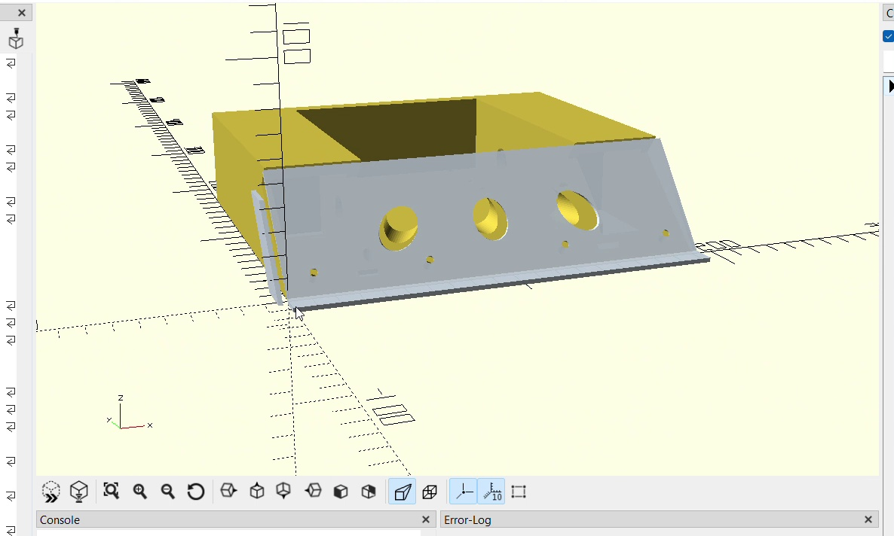
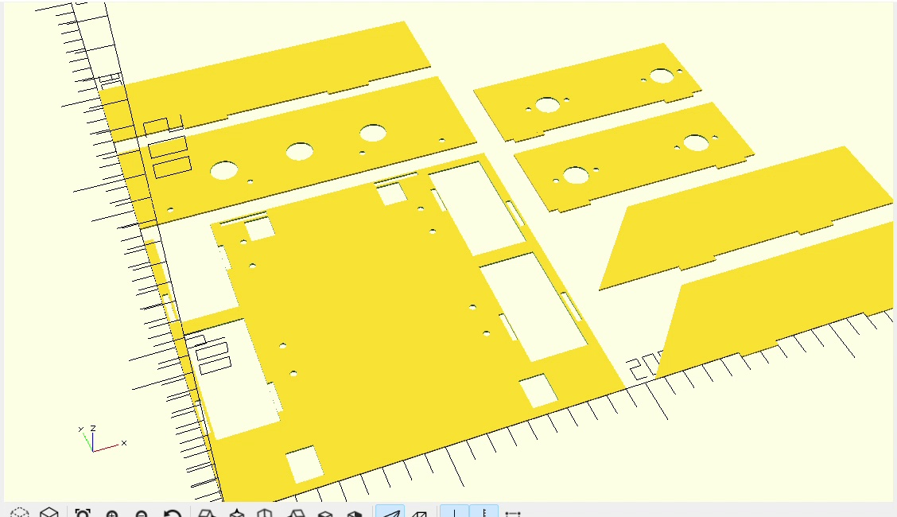

# Mechanical Design

This section shows the mechanical design of our Sumo Robot.

## Chassis

The robot must fit inside a 20 x 20 cm area.

We are designing a compact chassis to keep all the parts inside this size.

## 4-Wheel Drive

We decided to use four motors and four wheels.

Each wheel will have its own motor.

This gives the robot good movement and pushing power.

## Motor Position

The motors are long, so the motors on the left and right sides cannot be directly opposite each other.

We will place the motors at different positions so they can fit inside the chassis without touching each other.

## Hidden Wheels

We want the wheels and motors to be inside the robot body.

The side walls of the chassis will cover the wheels.

Only the bottom part of each wheel will touch the Sumo ring.

This will give the robot a compact and protected design.

## Front Wedge

The robot will have a front wedge.

The wedge will help the robot get under the opponent and push it outside the ring.

The front edge will not be sharp.

## Design Process

We will make different versions of the chassis.

After each test, we will check the design and make changes if needed.

Our first design will be saved as **Version 1 (V1)**.
## Version 1 - First Chassis Design

This was our first chassis design made using OpenSCAD.

We designed a closed body with a front wedge and space for the robot parts.

## Laser-Cut Prototype

Before making the final chassis, we prepared the design for laser cutting.

We wanted to make a quick prototype to:

- Check the robot size.
- Check if the parts fit together.
- Test the motor and wheel positions.
- Find problems before making the final chassis.

This prototype helped us save time before making the next version.
